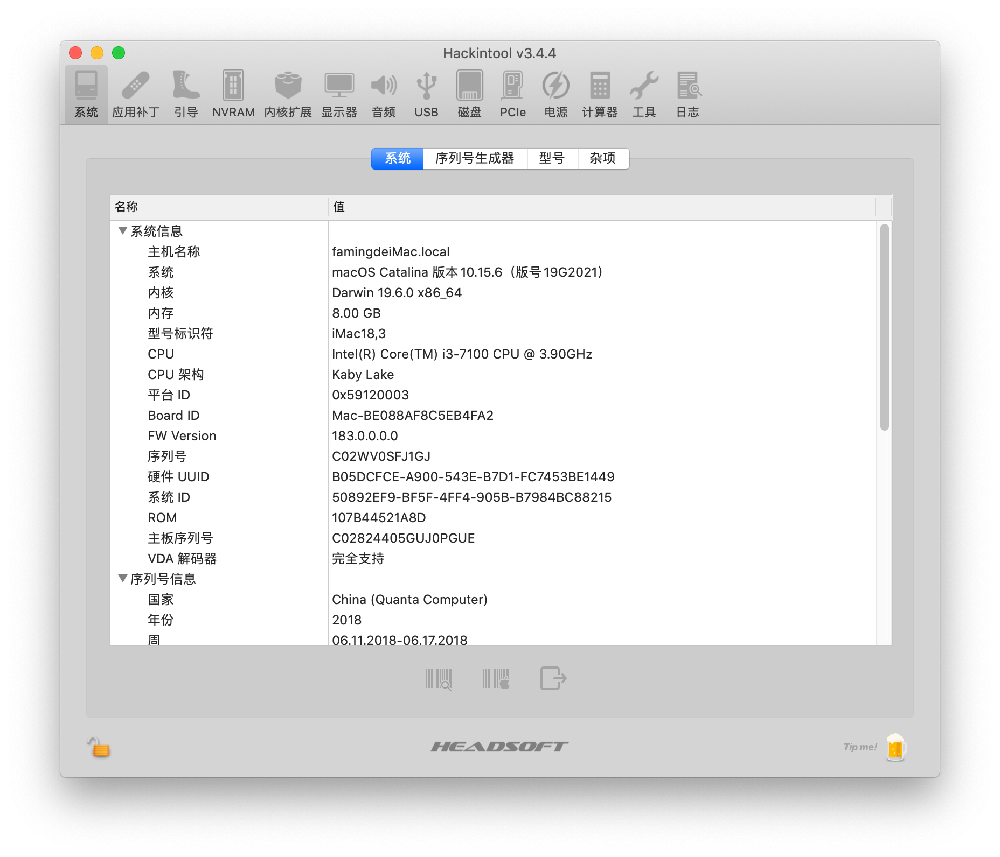
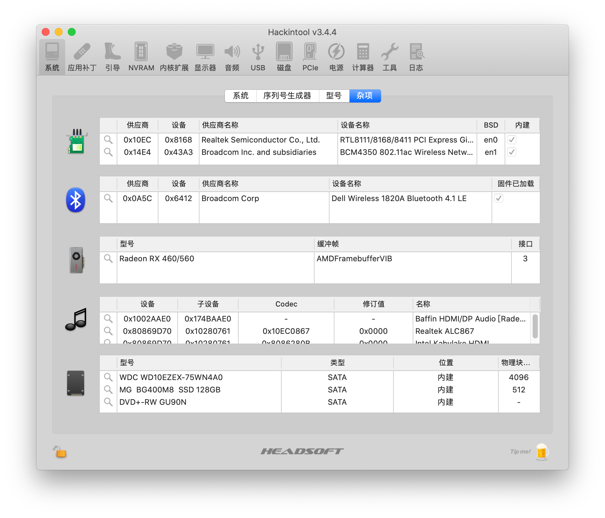
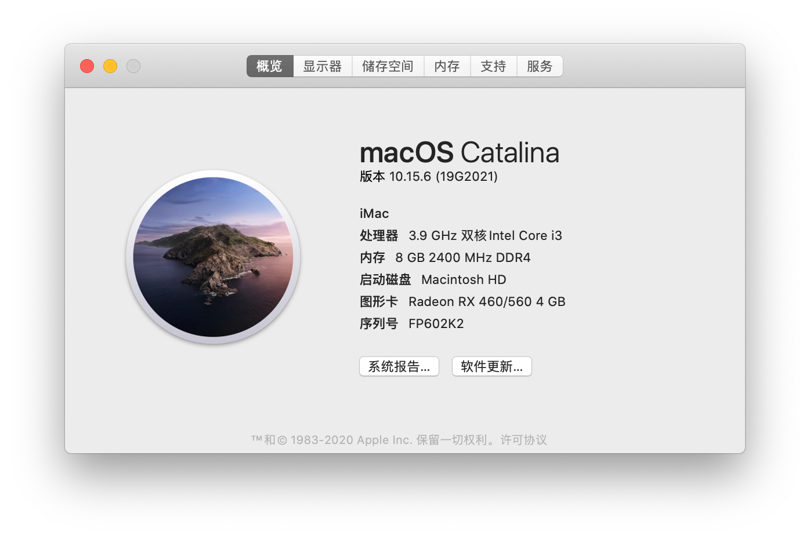
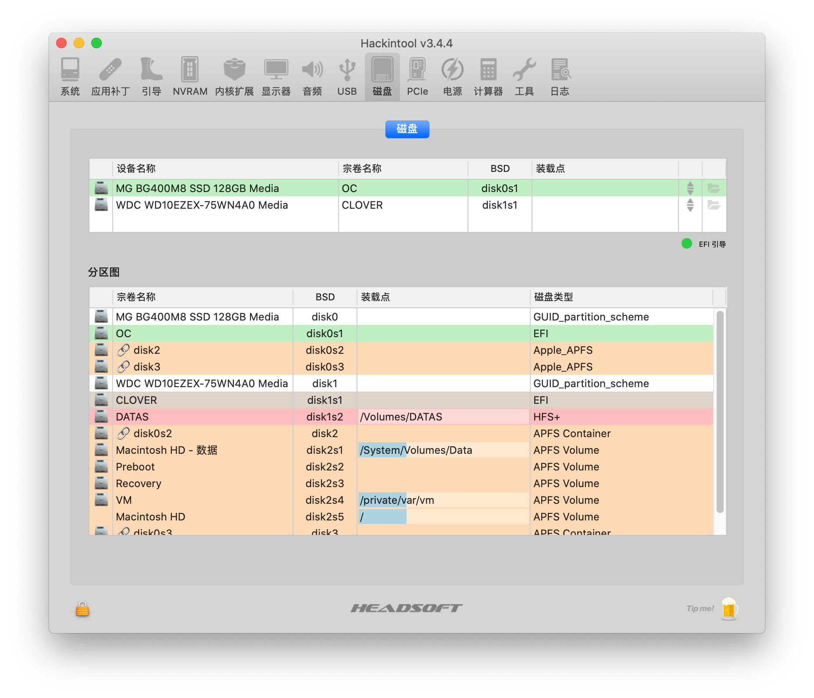
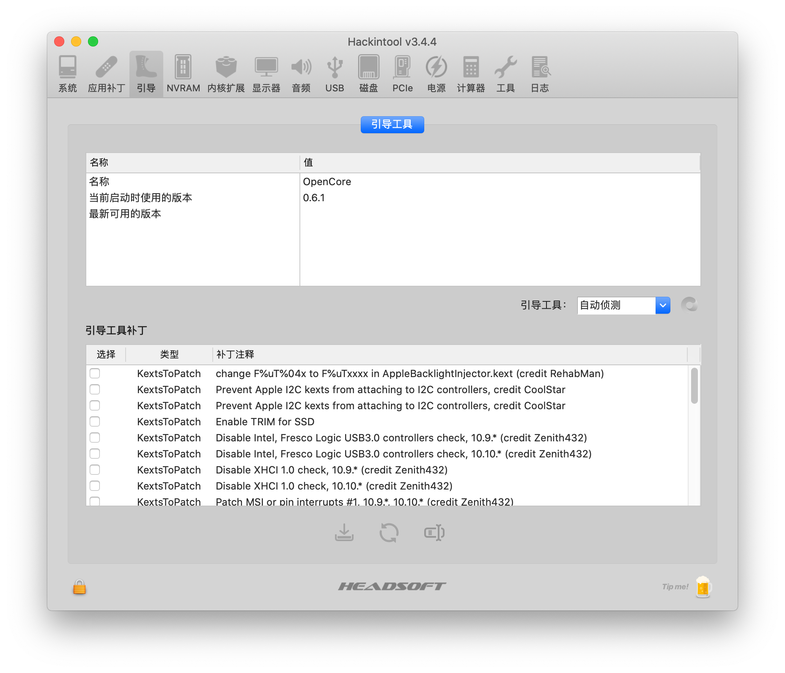

# Dell Vostro 3669 Hackintosh

## 电脑配置

|   规格   |                           详细信息                           |
| :------: | :----------------------------------------------------------: |
| 电脑型号 |                       Dell Vostro 3669                       |
| 操作系统 |               macOS Catalina 10.15.6 `19G2021`               |
|  处理器  |                    英特尔 酷睿 i3 - 7100                     |
|   内存   |                             8 GB                             |
|   硬盘   |                    mSATA 120GB + SATA 1TB                    |
|   显卡   |             Intel HD Graphics 630 + 蓝宝石RX460              |
|  显示器  |                                                              |
|   声卡   |                Realtek ALC867 `layout-id:13`                 |
|   网卡   | Realtek 8168 +  [DW1820A ](https://blog.daliansky.net/DW1820A_BCM94350ZAE-driver-inserts-the-correct-posture.html) |

## 引导器

`OpenCore` `v0.6.1开发版`

## 截屏

## 其它

- BIOS更新：
  - [Vostro_3668_3669_3268_3667_3660_3267_1.14.0.exe](./BIOS/Vostro_3668_3669_3268_3667_3660_3267_1.14.0.exe) 
- 镜像下载
  - [[**黑果小兵的部落阁**] :【黑果小兵】原版镜像](https://blog.daliansky.net/categories/下载/镜像/)
- EFI下载

  - [Releases](./releases)
- 更新日志  

  - [Changelog](Changelog.md)

